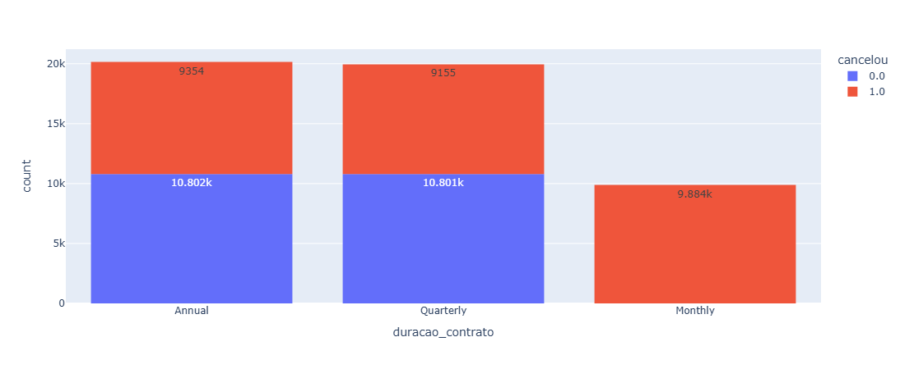
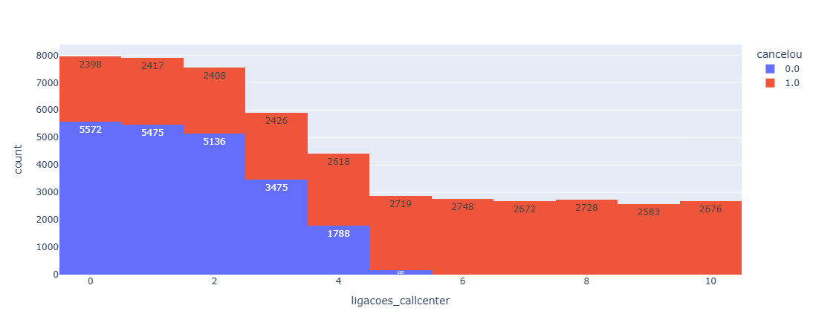
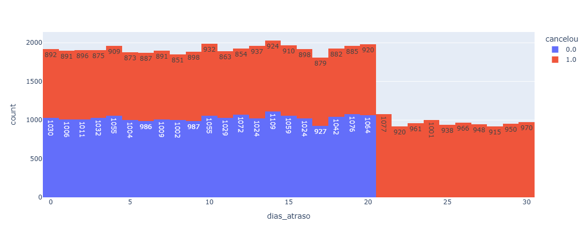

### Análise de Cancelamento de Clientes com Python 🔍

---

### 📋 Sobre o Projeto

Este projeto é uma análise exploratória de dados (EDA) realizada em uma base de 50 mil registros de clientes com o objetivo de:

✅ Identificar os principais motivos de cancelamento

✅ Descobrir padrões ocultos nos dados

✅ Gerar insights acionáveis para redução de churn

✅ Demonstrar habilidades em Python + Analytics

---

### 🎯 O Desafio 

Uma empresa com 800 mil clientes enfrentava um problema crítico:

80% dos clientes estavam cancelando o serviço e
não sabiam os motivos específicos de cada cancelamento.
Precisava de ações concretas para reverter o cenário.

---

### ✨ A Solução

Utilizei análise exploratória de dados com Python para descobrir que apenas 3 fatores explicam 100% dos cancelamentos.

---

### 🚀  PRINCIPAIS DESCOBERTAS

### Padrão 1️⃣: Tipo de Contrato

Contratos MENSAIS → Taxa de Cancelamento: 100%
Contratos ANUAIS → Taxa de Cancelamento: 20%

Ação: Redesenhar política de contratos para incentivar anuais 

**📸 Gráfico 1: Taxa de Cancelamento por Tipo de Contrato**

---

### Padrão 2️⃣: Qualidade de Atendimento

4+ chamadas ao call center → Taxa de Cancelamento: 100%
1-2 chamadas → Taxa de Cancelamento: 15%

Ação: Treinar equipe para resolver na 1ª chamada (First Contact Resolution

**📸 Gráfico 2: Impacto de Chamadas ao Call Center**

---

## Padrão 3️⃣: Gestão de Cobrança

Atraso >20 dias em pagamento → Taxa de Cancelamento: 100%
Atraso <20 dias → Taxa de Cancelamento: 10%

Ação: Cobrador deve agir ANTES do dia 20 de atraso

**📸 Gráfico 3: Efeito do Atraso em Pagamento**

---

## 🛠️ Tecnologias Utilizadas

### Data Processing

- **Pandas** — Limpeza, transformação e análise dos dados
- **NumPy** — Operações numéricas e arrays

## Data Visualization

- **Plotly Express** — Gráficos interativos e dinâmicos
- **Matplotlib** — Visualizações estatísticas

## ⚙️ Ambiente

- **Python**
- **Jupyter Notebook** — Desenvolvimento interativo
- **Google Drive** — Armazenamento de dados
  
---

